# 计算机毕业设计基于YOLO和多模态大语言模型的智慧交通监控预警系统 大模型毕业设计 人工智能(源码+文档+PPT+讲解)
# 基于YOLO和多模态大语言模型的智慧交通监控预警系统 
 
## 项目概述

智慧交通监控预警系统是一套基于人工智能技术的智能交通监控解决方案，专为道路交通管理设计。系统通过先进的计算机视觉算法和大语言模型技术，能够实时分析交通监控画面，自动识别潜在的交通情况和交通异常情况，为道路交通安全提供24小时不间断的智能监控。系统集成了图片检测、视频检测、实时检测、模型评估、模型管理、数据集管理等多项功能，构建了一个完整的智慧交通监控预警系统。

### 技术创新点
1. **目标精准检测**: 支持交通情况和交通异常情况的智能识别和定位
2. **多模态检测方式**: 支持图片、视频、实时摄像头三种检测模式
3. **YOLO模型集成**: 集成YOLOv8/YOLO11/YOLO12/YOLO26等先进目标检测模型
4. **智能预警分析**: 基于AI的交通情况和交通异常情况自动识别、定位与分级预警
5. **分层权限管理**: 支持管理员和普通用户的差异化功能访问
6. **完整工作流程**: 从数据集管理到模型管理再到检测分析预警的完整闭环
7. **多模态大模型辅助分析**: 使用GLM多模态大模型提供图片安全分析（结果评估+详细分析+安全防护建议）、视频关键帧AI诊断、实时检测异常诊断三大场景，支持用户填写补充信息以引导分析方向
8. **模型评估系统**: 支持GT标签与预测结果对比，自动计算精度指标(Precision/Recall/mAP50)，生成可视化对比图，支持用户评分和筛选
9. **实时预警系统**: 支持ByteTrack多目标跟踪、会话级智能去重、AI异常诊断(发现异常记录+报警/未见异常仅记录/未开启诊断不记录)、严重程度五级分级(可忽略/轻微/中等/严重/紧急)、处理状态管理、实时通知预警、多维度筛选和批量操作

## 要求
### 源码有偿！一套(论文 PPT 源码+sql脚本+教程)

### 
### 加好友前帮忙start一下，并备注github有偿实验室安全预警27
### 我的QQ号是2827724252或者微信:code520888 或者 bysj2023nb

# 

### 加qq好友说明（被部分 网友整得心力交瘁）：
    1.加好友务必按照格式备注
    2.避免浪费各自的时间！
    3.当“客服”不容易，repo 主是体面人，不爆粗，性格好，文明人。

## 运行演示视频

https://www.bilibili.com/video/BV1rbuV6AEHu

## 运行截图


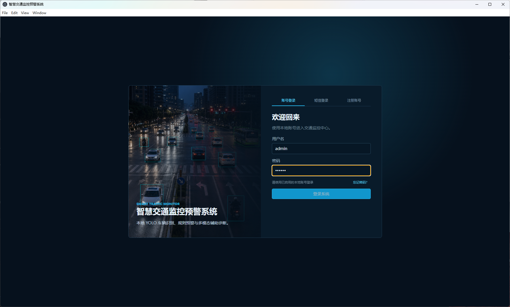
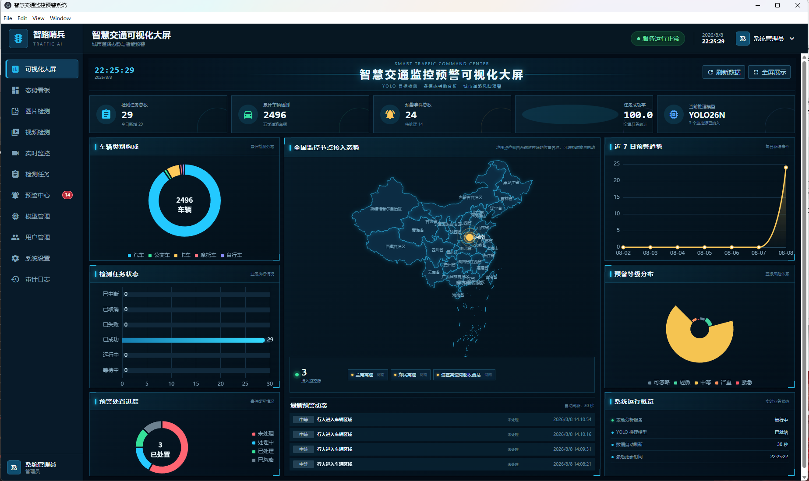
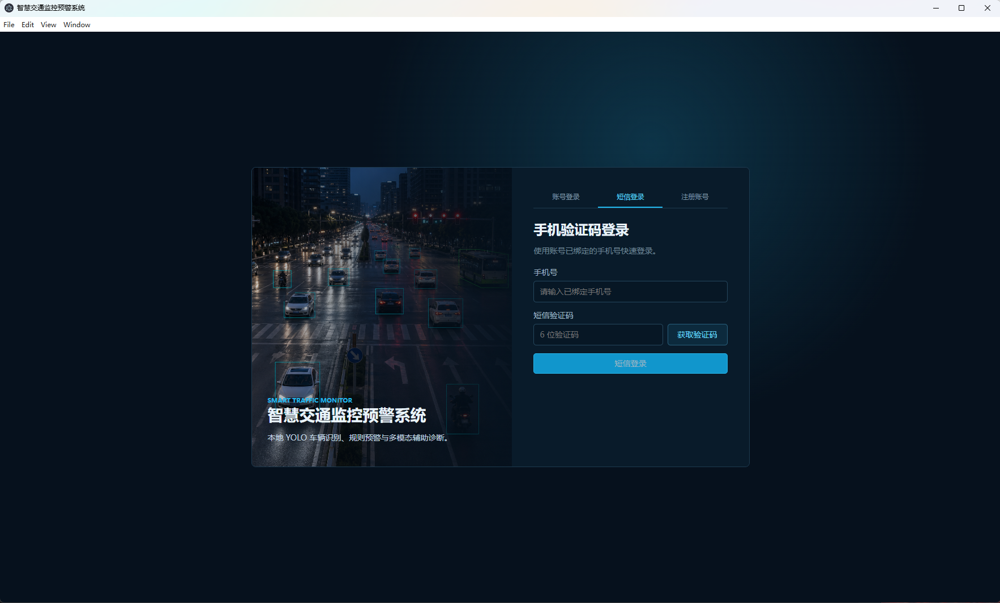
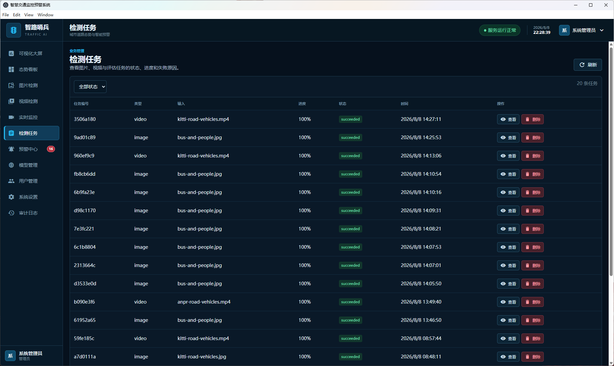
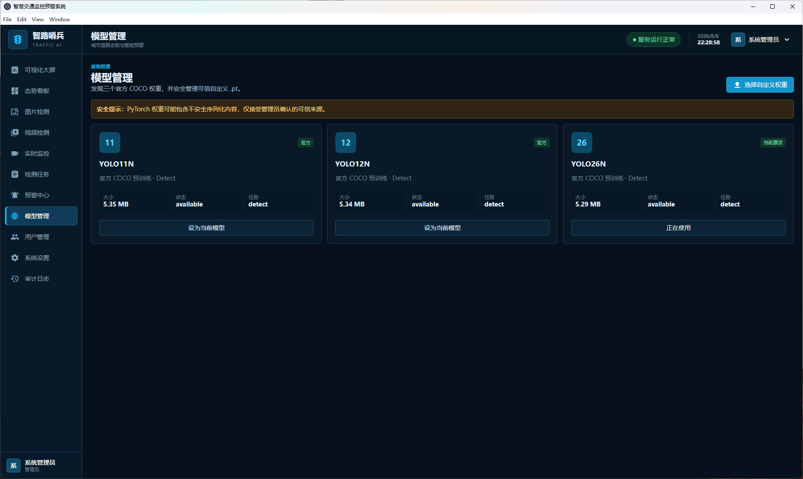
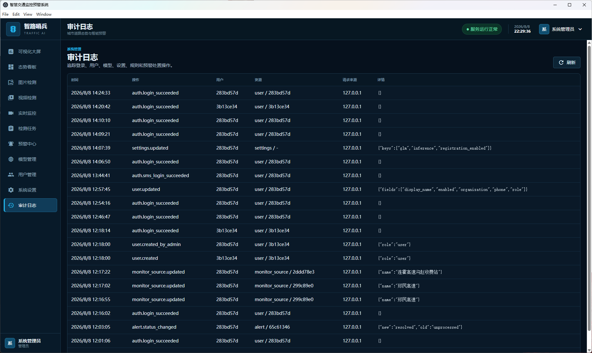
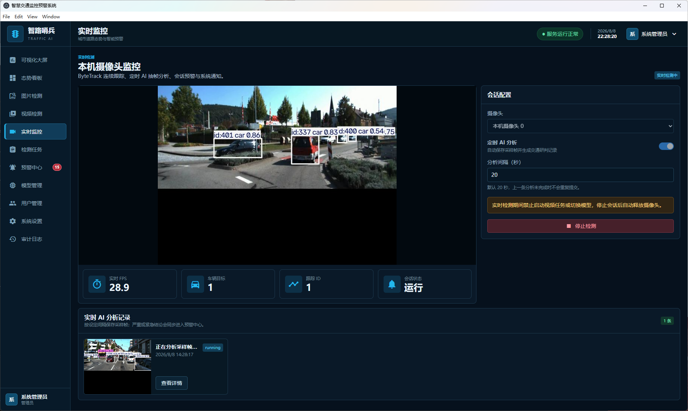
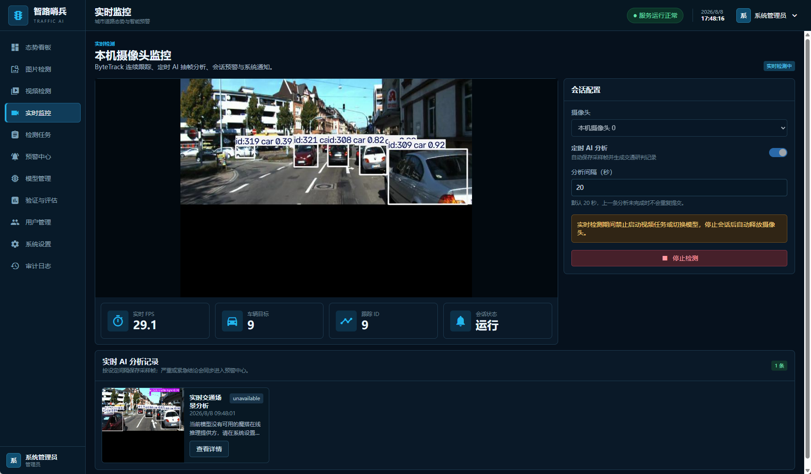

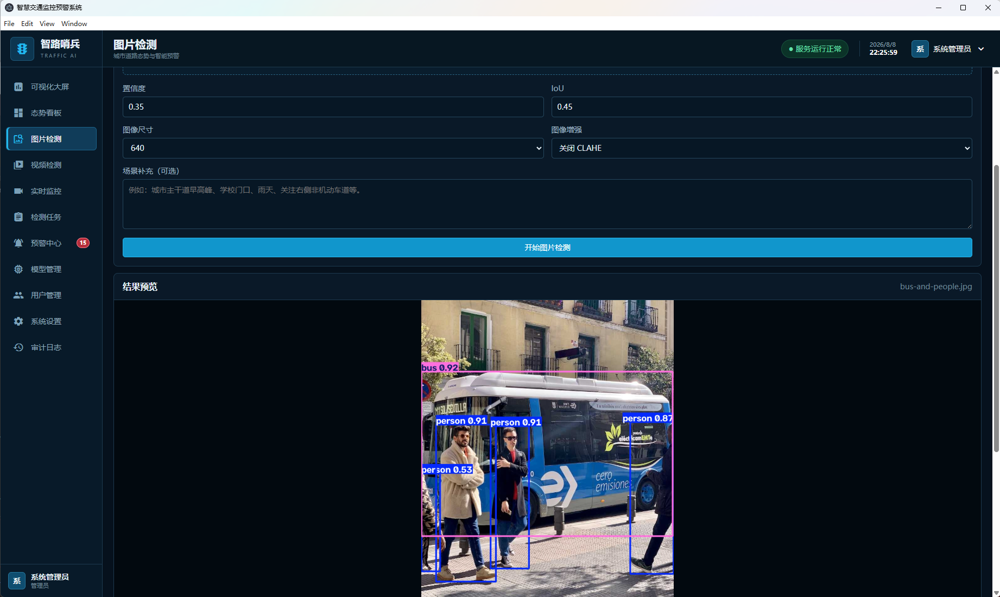
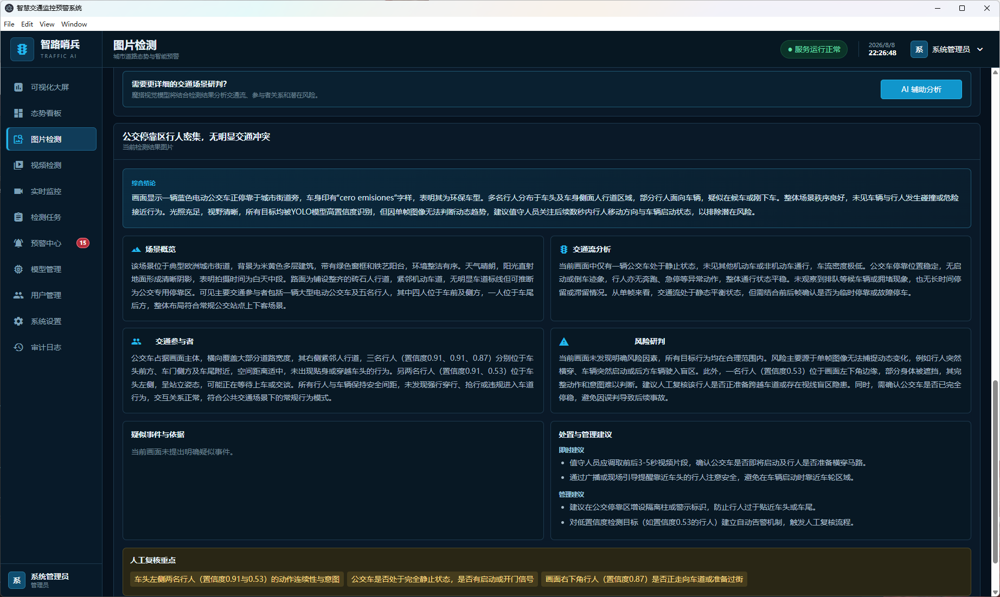
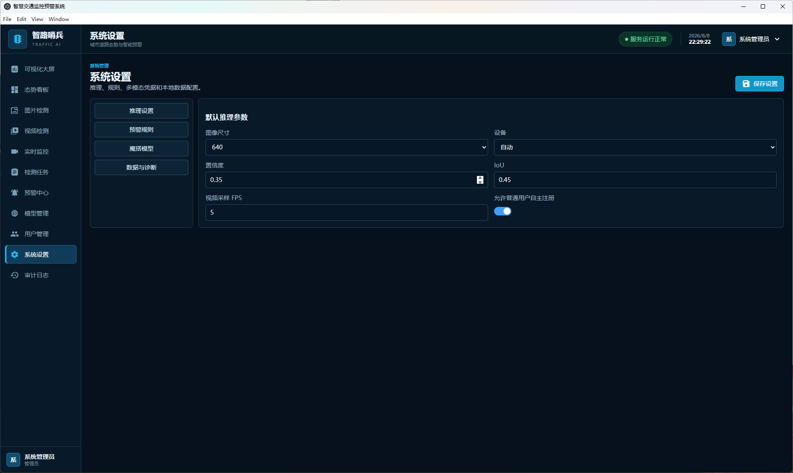
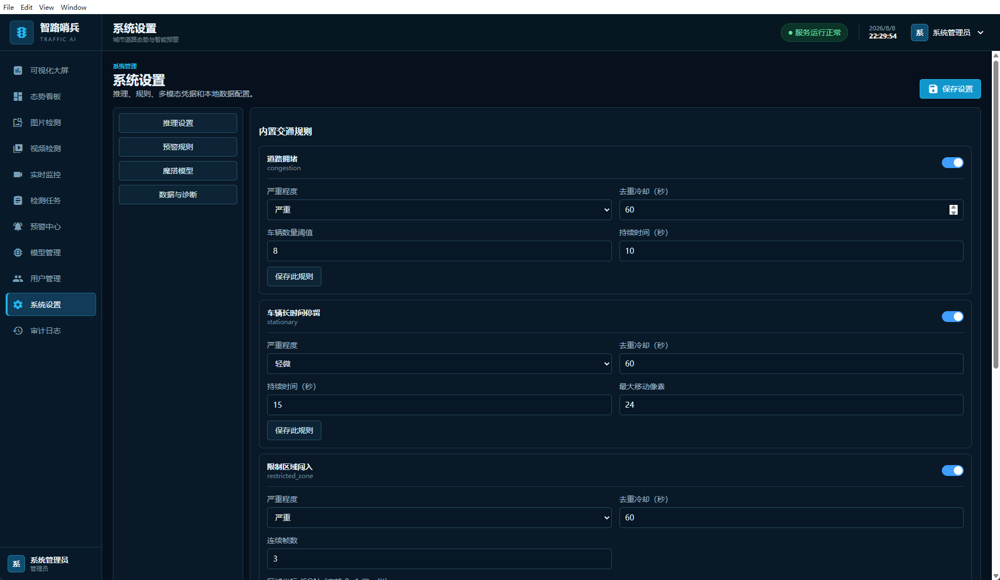
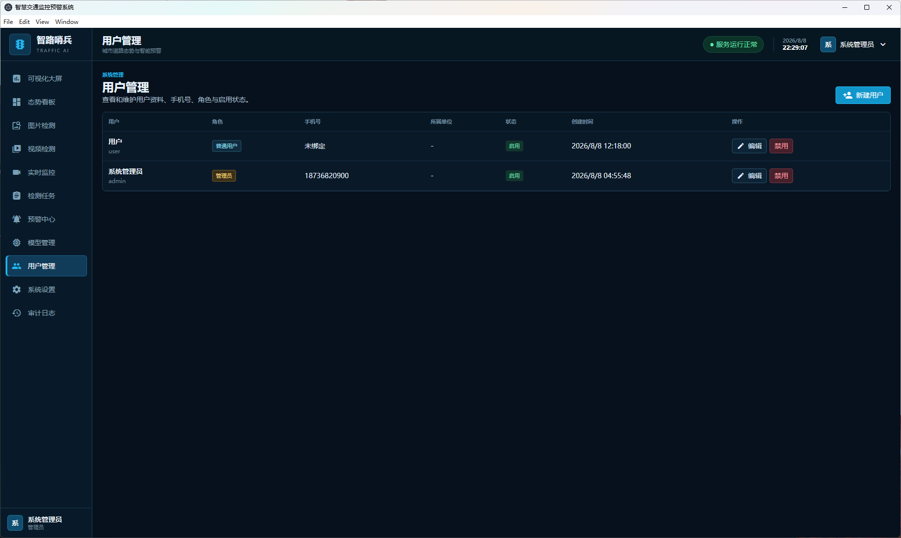
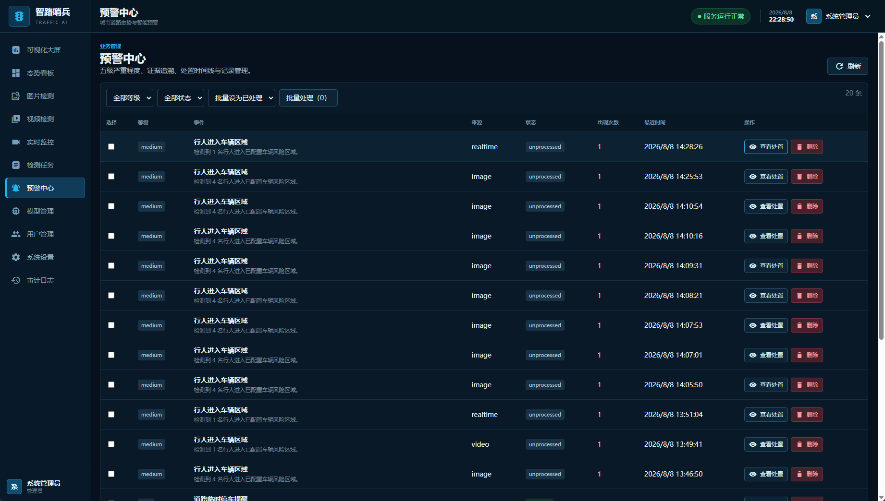
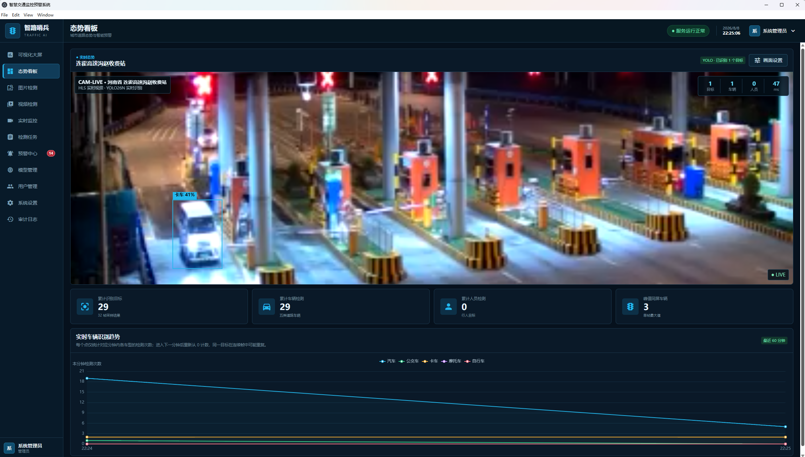


## 系统架构

### 整体架构设计

系统采用前后端分离架构设计，分为前端展示层、后端业务层、算法服务层和文件存储层四个主要部分：

```
┌─────────────────┐    		┌─────────────────┐
│   前端层 (Vue3)  │────	│  后端层 (Flask)  │
│   Port: 3000    │    		│   Port: 5020    │
│ 智慧交通监控预警管理UI│    │  业务逻辑处理     │
│  检测结果展示     │    	│  AI检测引擎      │
└─────────────────┘    		└─────────────────┘
                                │
                       ┌─────────────────┐    ┌─────────────────┐
                       │  文件服务层       │    │   数据库层       │
                       │   Port: 5020    │    │   SQLite 3      │
                       │  图片视频存储     │    │ 检测预警记录数据  │
                       └─────────────────┘    └─────────────────┘
```


## 技术栈详解

#### 前端技术栈
- **核心框架**: Vue 3.5.13 (Composition API)
- **UI组件库**: Element Plus 2.9.4
- **状态管理**: Pinia 2.3.1
- **路由管理**: Vue Router 4.5.0
- **HTTP客户端**: Axios 1.7.9
- **图表可视化**: ECharts 5.6.0
- **视频播放**: flv.js 1.6.2
- **构建工具**: Vite 6.1.0 + TypeScript 5.7.2
- **样式预处理**: Sass 1.84.0

#### 后端技术栈
- **核心框架**: Flask (Python)
- **数据库**: SQLite 3
- **身份认证**: JWT
- **图像处理**: OpenCV + NumPy
- **深度学习**: YOLOv8/YOLO11/YOLO12
- **视频处理**: OpenCV视频流处理
- **实时检测**: 摄像头实时流处理

## 核心功能
核心功能模块
1. 用户管理: 支持用户注册、登录、权限管理、个人信息管理等功能
2. 模型管理: 支持创建模型、上传权重、训练过程图片/文件管理、模型发布等
3. 图片检测: 上传图片进行智慧交通监控检测，支持CLAHE图像增强、AI安全分析（结果评估+详细分析，支持用户补充信息）、预警建议生成、导出Word报告
4. 视频检测: 上传视频进行逐帧检测，支持帧率采样、异步处理、进度查询、关键帧截图保存、对关键帧手动触发AI诊断（发现异常/未见异常）
5. 实时检测: 使用电脑摄像头进行实时检测，会话级智能去重、AI异常诊断（发现异常记录+报警/未见异常仅记录/未开启诊断不记录）、严重程度五级分级(可忽略/轻微/中等/严重/紧急)、处理状态管理(未处理/已处理)、实时通知预警、多维度筛选(用户/严重程度/诊断结果/处理状态)